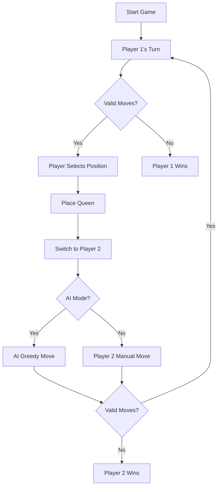

# 2-Player Queens Game - DAA Project

## 🎯 Project Overview

A strategic 2-player board game based on the **N-Queens problem**, demonstrating **Greedy Algorithm** usage for a Design and Analysis of Algorithms (DAA) course.

---

## 📋 Game Objective

- **Board**: N × N chessboard with colored regions
- **Players**: Two players (Player 1 and Player 2) alternate turns
- **Rule**: Place queens such that no queen attacks another
- **Win Condition**: The player who cannot make a valid move **loses**
- **Strategy**: Outplay opponent through optimal queen placement

---

## ⚙️ Algorithmic Requirements

### 1. **Greedy Algorithm (Core Implementation)**

At each turn, the algorithm:
- ✅ Evaluates **all valid positions**
- ✅ Selects the position that **maximizes future available safe positions**
- ✅ Makes **locally optimal** decisions
- ❌ **NO** backtracking or exhaustive search

**Time Complexity**: O(N³) per move
- O(N²) to check all positions
- O(N) to evaluate each position's future options

### 2. **State Evaluation**

For each candidate cell:
```
futureOptions = countSafePositions(afterPlacingQueen)
chosenMove = argmax(futureOptions)
```

### 3. **Graph Interpretation**

The game is modeled as a **state graph**:
- **Nodes** = Board states
- **Edges** = Valid queen placements
- **Greedy Choice** = Next state with maximum degree (future moves)

---

## 🧠 Core Functions

### Backend (Java/Spring Boot)

#### `isSafe(position, queenPositions)`
Checks if a position is safe:
- No attack from existing queens (row, column, diagonals)
- Region not already occupied

#### `getAllValidMoves(gameState)`
Returns all legal queen placements considering:
- Queen attack patterns
- Region constraints

#### `evaluateMove(gameState, position)`
**GREEDY HEURISTIC**:
```java
int evaluateMove(GameState gameState, int position) {
    List<Integer> tempQueens = gameState.queenPositions + position;
    int safeCount = 0;
    
    for (int cell : allCells) {
        if (isSafe(cell, tempQueens)) {
            safeCount++;
        }
    }
    
    return safeCount; // Higher is better
}
```

#### `greedyMove(gameState)`
**GREEDY ALGORITHM**:
```java
int greedyMove(GameState gameState) {
    int bestPosition = -1;
    int maxFutureOptions = -1;
    
    for (int position : validMoves) {
        int futureOptions = evaluateMove(gameState, position);
        
        if (futureOptions > maxFutureOptions) {
            maxFutureOptions = futureOptions;
            bestPosition = position; // Greedy choice
        }
    }
    
    return bestPosition;
}
```

---

## 👥 Game Modes

### 1. Human vs Human 🧑‍🤝‍🧑
- Both players manually select positions
- Tests strategic thinking

### 2. Human vs AI 🧑‍💻🤖
- Player 1: Human
- Player 2: Greedy AI
- Demonstrates algorithm decision-making

---

## 🎮 Game Flow



---

## 🔍 Why Greedy Algorithm?

### ✅ **Advantages**:
1. **Fast Decision Making**: O(N³) vs O(N!) for exhaustive search
2. **Locally Optimal**: Always picks "best" next move
3. **Simple to Implement**: No complex recursion
4. **Demonstrable**: Easy to visualize and explain

### ❌ **Limitations**:
1. **Not Globally Optimal**: May miss better long-term strategies
2. **Myopic**: Doesn't consider opponent's future moves
3. **Can Lose**: Greedy doesn't guarantee winning

### 📊 **Educational Value**:
This is **NOT** the classic N-Queens puzzle (finding all solutions).  
This is a **game strategy problem** where greedy is appropriate because:
- Real-time decision making required
- Perfect play not expected
- Demonstrates algorithm trade-offs

---

## 🛠️ Technical Stack

**Backend**:
- Java 17
- Spring Boot 4.0
- REST API

**Frontend**:
- React 19
- TypeScript
- Next.js 16

**Algorithm**:
- Greedy Heuristic
- Graph-based board representation

---

## 🚀 How to Run the Project

### Prerequisites

**Required Software**:
- ✅ Java JDK 17 or higher ([Download](https://www.oracle.com/java/technologies/downloads/))
- ✅ Node.js 20+ ([Download](https://nodejs.org/))
- ✅ Maven (included with project)

**Verify Installation**:
```powershell
# Check Java
java -version
# Should show: java version "17.x.x" or higher

# Check Node.js
node --version
# Should show: v20.x.x or higher

# Check npm
npm --version
# Should show: 10.x.x or higher
```

---

### Step 1: Start Backend (Spring Boot)

**Option A: Using PowerShell (Windows)**
```powershell
# Navigate to backend folder
cd "c:\Users\Akhil's-OMEN\Desktop\Amrita\SEM_4\DAA\DAA-Project\Queens-Game\backend"

# Run Spring Boot application
.\mvnw.cmd spring-boot:run
```

**Option B: Using IDE (IntelliJ IDEA/Eclipse)**
1. Open `backend` folder in your IDE
2. Right-click `BackendApplication.java`
3. Select "Run 'BackendApplication'"

**Success Indicators**:
```
✓ Started BackendApplication in X.XXX seconds
✓ Tomcat started on port(s): 8080 (http)
```

**Backend is now running at**: `http://localhost:8080`

---

### Step 2: Start Frontend (Next.js)

**Open a NEW PowerShell window** (keep backend running):

```powershell
# Navigate to frontend folder
cd "c:\Users\Akhil's-OMEN\Desktop\Amrita\SEM_4\DAA\DAA-Project\Queens-Game\frontend"

# Install dependencies (first time only)
npm install

# Start development server
npm run dev
```

**Success Indicators**:
```
✓ Ready in X.Xs
- Local:   http://localhost:3000
- Network: http://YOUR_IP:3000
```

**Frontend is now running at**: `http://localhost:3000`

---

### Step 3: Play the Game!

1. **Open your browser** and go to: `http://localhost:3000`

2. **Enter board size**: Type `8` (or any number ≥ 6) in the "Enter N" field

3. **Select game mode**:
   - **👤 vs 👤** (Human vs Human) - Play with a friend
   - **👤 vs 🤖** (Human vs AI) - Play against greedy algorithm

4. **Start playing**:
   - Blue dots show valid moves
   - Click a dot to place a queen 👑
   - Watch AI make greedy decisions!

---

### Quick Start (All-in-One Commands)

**Terminal 1 - Backend**:
```powershell
cd "c:\Users\Akhil's-OMEN\Desktop\Amrita\SEM_4\DAA\DAA-Project\Queens-Game\backend"; .\mvnw.cmd spring-boot:run
```

**Terminal 2 - Frontend**:
```powershell
cd "c:\Users\Akhil's-OMEN\Desktop\Amrita\SEM_4\DAA\DAA-Project\Queens-Game\frontend"; npm run dev
```

---

### Troubleshooting

#### ❌ Port 8080 already in use
```powershell
# Find and kill process on port 8080
netstat -ano | findstr :8080
taskkill /PID <PID_NUMBER> /F
```

#### ❌ Port 3000 already in use
```powershell
# Frontend will automatically use port 3001
# Or kill process on port 3000
netstat -ano | findstr :3000
taskkill /PID <PID_NUMBER> /F
```

#### ❌ "mvnw is not recognized"
```powershell
# Use full Maven command
mvn spring-boot:run
```

#### ❌ "npm is not recognized"
- Restart PowerShell after installing Node.js
- Or add Node.js to PATH manually

---

### Testing the Integration

**Test Backend API** (in browser or Postman):
```
GET http://localhost:8080/api/game/init
```

**Expected Response**: JSON with game state

---

### Stopping the Application

**Backend**: Press `Ctrl + C` in the backend terminal

**Frontend**: Press `Ctrl + C` in the frontend terminal

---

## 🎮 Game Controls

| Action | How To |
|--------|--------|
| **New Game** | Click "🎲 New Game" button |
| **Change Mode** | Use dropdown menu (👤 vs 👤 or 👤 vs 🤖) |
| **Show/Hide Hints** | Click "Show Hints" button |
| **Place Queen** | Click on blue dot (valid move) |
| **Watch AI** | Select Human vs AI mode, AI moves automatically |

---

## 🚀 Running the Project

### Backend
```bash
cd backend
./mvnw spring-boot:run
# Server runs on http://localhost:8080
```

### Frontend
```bash
cd frontend
npm install
npm run dev
# App runs on http://localhost:3000
```

---

## 📊 Output Format

### During Game:
```
Player 1's Turn
Valid Moves: 42
Player 1 Queens: 2 | Player 2 Queens: 1

[Board Display with colored regions]

AI is thinking... (Greedy Algorithm)
AI selected position (4,3) - maximizes future options
Remaining valid moves: 38
```

### Game End:
```
🎉 Player 1 Wins! 🎉
Player 1: 5 queens
Player 2: 4 queens
Opponent has no valid moves.
```

---

## 🧪 Complexity Analysis

### Space Complexity
- **Board State**: O(N²)
- **Queen Positions**: O(N)
- **Total**: O(N²)

### Time Complexity (Per Move)
- **isSafe**: O(N) - check against all queens
- **getAllValidMoves**: O(N²) - check all cells
- **evaluateMove**: O(N²) - simulate and count
- **greedyMove**: O(N² × N²) = **O(N⁴)** worst case
- **Optimized**: O(N³) with pruning

---

## 📚 Academic Justification

### Why This Design?

1. **Greedy is Appropriate**:
   - Game requires quick decisions
   - Demonstrates algorithm trade-offs
   - Shows local vs global optimization

2. **Not Classic N-Queens**:
   - Classic: Find all valid placements (NP-complete)
   - This: Strategic 2-player game (game theory)

3. **DAA Concepts Demonstrated**:
   - Greedy algorithms
   - Time/space complexity
   - Graph representation
   - State space search
   - Heuristic evaluation

---

## 🎓 Learning Outcomes

Students will understand:
- ✅ How greedy algorithms make decisions
- ✅ Trade-offs between optimality and efficiency
- ✅ Difference between optimization and game strategy
- ✅ Practical algorithm analysis
- ✅ When greedy is (and isn't) appropriate

---

## 👨‍💻 Authors

Created for Design and Analysis of Algorithms Course  
Demonstrates practical application of greedy algorithms in game design.

---

## 📝 License

Educational project for academic purposes.
